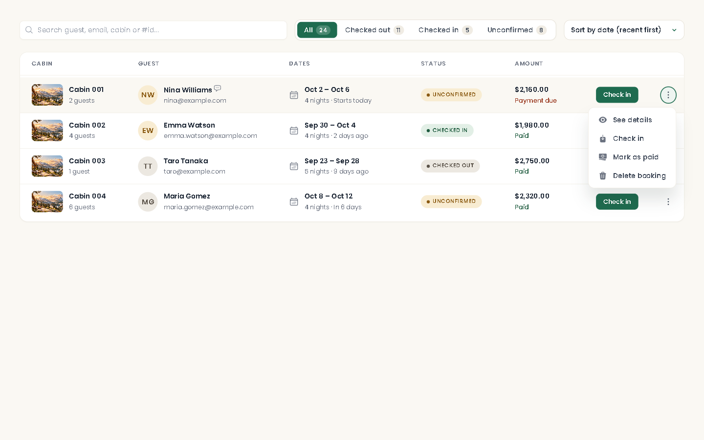
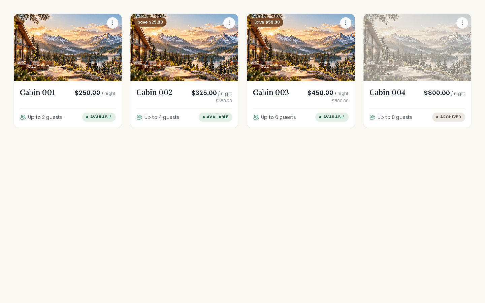
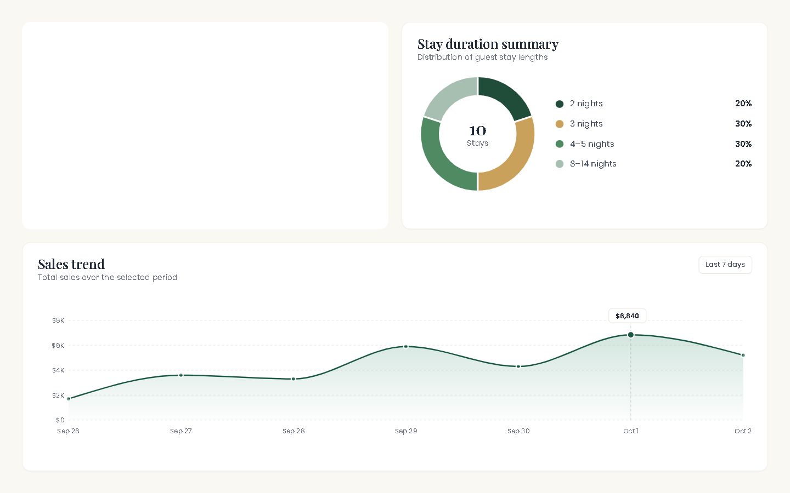

# Ardevane Operations

The internal dashboard for a mountain cabin resort. Front-desk staff use it to run the day: who arrives, who leaves, which cabins are free, what has been paid.

## What it does

- **Bookings** — search by guest, email, cabin or booking number; filter by status with live counts; check guests in and out from the row; mark a booking as paid.
- **Today** — arrivals and departures for the current day on the dashboard, with sales and stay-length charts for the last 7, 30 or 90 days.
- **Cabins** — photo cards with the nightly price after discount; a gallery per cabin; archive a cabin instead of deleting it, so its booking history stays.
- **Guests** — every guest with their stays, nights and total spend.
- **Occupancy calendar** — each cabin on a timeline, so free nights are easy to spot.
- **Team and settings** — staff accounts, and the rules every booking is priced against.
- Light and dark themes, and a layout that works from a phone to a wide screen.

## Built with

React · React Router · TanStack Query · styled-components · Recharts · Supabase (Postgres, Auth, Storage) · Vite · Vitest

## Under the hood

- The booking search runs inside Postgres through a view, so one box can match a guest, an email, a cabin or a booking number, and only one page of results is ever downloaded.
- Every table is locked with row-level security: only signed-in staff can read or change anything.
- "Today" is worked out in the hotel's own time zone, so a stay never disappears from the list in the hours after midnight.
- Each page is loaded only when it is opened.
- Pricing, date and guest-stat logic is covered by unit tests.

